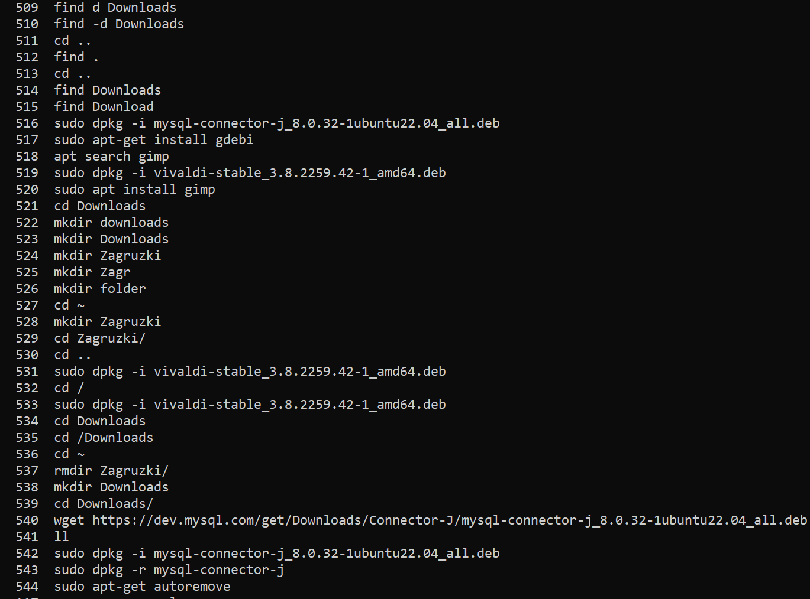

# ИТОГОВАЯ КОНТРОЛЬНАЯ
## 1. Используя команду cat в терминале операционной системы Linux, создать два файла Домашние животные ((заполнив файл собаками, кошками, хомяками) и Вьючные животными заполнив файл Лошадьми, верблюдами и ослы), а затем объединить их. Просмотреть содержимое созданного файла. Переименовать файл, дав ему новое имя (Друзья человека).
Создаём файл "Домашние животные" и заполняем его

Создаём файл "Вьючные животные" и заполняем его

Объединим эти 2 файла в 1 дав ему имя "Human_Friends"

Смотрим его содержание

## 2. Создать директорию, переместить файл туда.

## 3. Подключить дополнительный репозиторий MySQL. Установить любой пакет из этого репозитория.

Обновляем информацию о пакетах и видим подключенный репозиторий mysql

Устанавливаем mysql-server (У меня он уже установлен)

## 4. Установить и удалить deb-пакет с помощью dpkg

Скачиваем файл

Устанавливаем пакет скаченый пакет

Удаляем пакет

## 5. Выложить историю команд в терминале ubuntu.

## 6. Нарисовать диаграмму, в которой есть класс родительский класс, домашние животные и вьючные животные, в составы которых в случае домашних животных войдут классы: (собаки, кошки, хомяки), а в класс вьючные животные войдут: (Лошади, верблюды и ослы).

## 7. В подключенном MySQL репозитории создать базу данных “Друзья человека”

